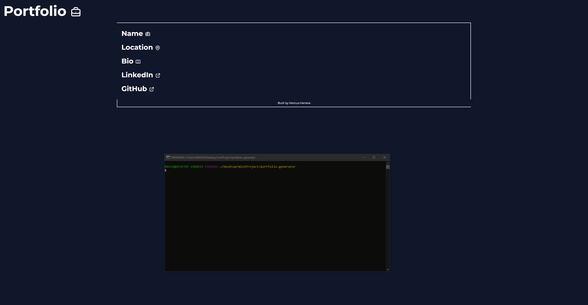

# Portfolio Generator

  

## Description

An app that asks for info about the user to generate a simple portfolio

## Table of Contents
- [Description](#description)
- [Installation](#installation)
- [Usage](#usage)
- [License](#license)
- [Contributing](#contributing)
- [Tests](#tests)
- [Questions](#questions)

## Installation

Clone the repository. Run "npm i inquirer"

## Usage

Run "node index.js" in the root of the app directory

## Mock-up

## License

      Permission is hereby granted, free of charge, to any person obtaining a copy of 
      this software and associated documentation files (the "Software"), to deal in the Software 
      without restriction, including without limitation the rights to use, copy, modify, merge, 
      publish, distribute, sublicense, and/or sell copies of the Software, and to permit persons 
      to whom the Software is furnished to do so, subject to the following conditions:

      The above copyright notice and this permission notice shall be included in all copies or substantial portions of the Software.

      THE SOFTWARE IS PROVIDED "AS IS", WITHOUT WARRANTY OF ANY KIND, EXPRESS OR IMPLIED,
      INCLUDING BUT NOT LIMITED TO THE WARRANTIES OF MERCHANTABILITY, FITNESS FOR A PARTICULAR
      PURPOSE AND NONINFRINGEMENT. IN NO EVENT SHALL THE AUTHORS OR COPYRIGHT HOLDERS BE LIABLE
      FOR ANY CLAIM, DAMAGES OR OTHER LIABILITY, WHETHER IN AN ACTION OF CONTRACT, TORT OR
      OTHERWISE, ARISING FROM, OUT OF OR IN CONNECTION WITH THE SOFTWARE OR THE USE OR OTHER
      DEALINGS IN THE SOFTWARE.

For more info visit: [MIT](https://opensource.org/licenses/MIT)

## Contributing 

Name and GitHub

## Tests

None

## Questions

Submit any questions about the app to Github, or email.
[GitHub](https://github.com/mahiv87)
maherreraiv1987@gmail.com
